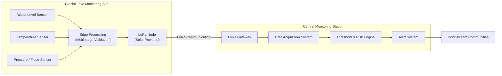

```mermaid
flowchart LR

    subgraph Field["Glacial Lake Monitoring Site"]
        A[Water Level Sensor]
        B[Temperature Sensor]
        C["Pressure / Flood Sensor"]
        D["Edge Processing\n(Multi-stage Validation)"]
        E["LoRa Node\n(Solar Powered)"]

        A --> D
        B --> D
        C --> D
        D --> E
    end

    E -- LoRa Communication --> F

    subgraph Central["Central Monitoring Station"]
        F[LoRa Gateway]
        G[Data Acquisition System]
        H[Threshold & Risk Engine]
        I[Alert System]

        F --> G --> H --> I
    end

    I --> J[Downstream Communities]
```

